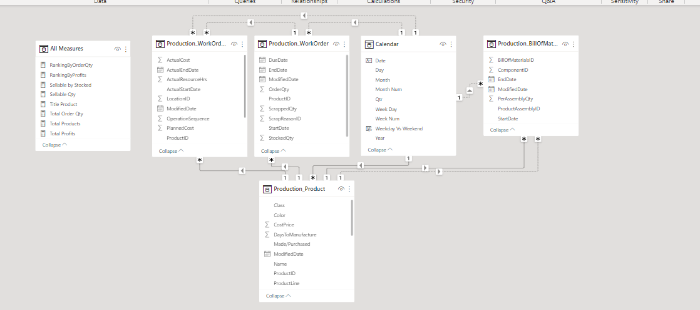

# AdventureWorks2019 Analysis

---
## Introduction
This project is a challenge on DAX Suggestion set up by the Microsoft Reactor Team. It is a Power BI project on Production and Work Order analysis of **Adventure Works 2019**. The project is to analyze and derive insights into Production performance by various categories and time period.

## Problem Statement
1. What is the Production over time?
2. What is the total revenue generated by products and their details over a period of time?
3. What are the top products ordered?
4. Which products required more costs?
5. What is the average hours spent per Production Line?

## Skills/Concepts Demonstrated
The following Power BI features were incorporated:
- DAX
- Quick measures
- Page navigation
- Modelling
- Filters
- Tooltips
- Button

## Data Sourcing
The link to the data source was provided by the team even though it had to go through SQL Server. I extracted the dataset from SQL server

AdventureWorks2019 database tables - Production.Product, Production.BillOfMaterials, Production.WorkOrder, and  Production.WorkOrderRouting.

The following tables were selected from the dataset to be used for the analysis
1. Production.BillOfMaterials Table
2. Production.Product Table
3. Production.WorkOrder Table
4. Production.WorkOrderRouting Table

## Data Transformation
1. Production.BillOfMaterials Table
- I changed Date/Time format to just Date since they all started from 12:00am for 'Start Date', 'End Date' and 'Modified date'.
- I got rid of Unit measure and BOM Level as they were not needed in my analysis.
2. Production.Product Table
- I converted the data type in 'MakeFlag' to whole number as 0 represented 'False' and 1 represented 'True', then I added a conditional column 'Made/Purchased' and changed 0 to 'Purchased' and 1 to 'Made'.
- I changed the data type in 'FinishedGoodsFlag' to whole number (same as 'MakeFlag'). I added a new column 'Sellable' where I replaced 0 to 'No' and 1 to 'Yes'.
- I renamed 'StandardCost' to 'CostPrice' for better understanding and 'ListPrice' to 'SellingPrice'.
- I created a 'Profit' column 

- I changed 'Size' column details: 38 - 44 = s, 46 - 52 = m, 54 - 60 = L, 62 and 70 = XL
- I changed 'Product Line' column details: R = Road, M = Mountain, T = Touring and S = Standard
- I changed 'Class' column details: H = High, M = Medium and L = Low
- I changed 'Style' column details: U = Universal, W = Women and M = Men
3. Production.WorkOrder
- I changed the data type in 'Start Date', 'End Date', 'Due Date' and 'Modified Date'

## Data Modelling
Automatically derived relationships are adjusted to remove and replace unwanted relationships with the required.

Adjusted Model          |           Auto-model
:----------------------:|:----------------------:
      |  

The model is a star schema.
There are 5-dimension tables and 1 fact table. The dimension tables are all joined to the fact table with a one-to-many relationship.

## Visualization
The report comprises of 5 pages:
1. Overview (Home)
2. Product
3. WorkOrder
4. WorkOrderRouting
5. Date

You can interact with the report [here](https://app.powerbi.com/groups/me/reports/a0efaa8a-05f0-4474-ba58-1f556510a1ab/ReportSection?experience=power-bi)

Features
- Has a Date and Production line filter.
- The four tabs at the top are buttons with hovering effects and each navigates through to the pages with similar name.

## Analysis
### Overview/Home Page: 
- There is a total of 504 products.
- 5M quantities were ordered in total.
- Total profits made within the time period is $90,752
### Product page: 

- There is a table showing Production details by class, color, style and name by size and profits made.
- There is a chart displaying top products with high revenues.
- There are 304 sellable products in total.
### Work Order page: 

- BB Ball bearing is the most ordered product with a total of 911.89k quantitites ordered.
- Mountain-100 Silver gave the highest revenue with each yielding profits of $1,488.
### Work Order Routing Page: 

- Touring line had the highest average spent hours in production.
### Date: 

- The highest revenue was generated in 2011 with a total of $37,465.

## Conclusion
- Road line has the highest impact on revenue generated.
- 2011 was the most productive year. 🤑
 
## Recommendation
For a deep dive into the analytics, the datasets of years between 2008 and 2011 will be required for better comparison and data driven decision.
